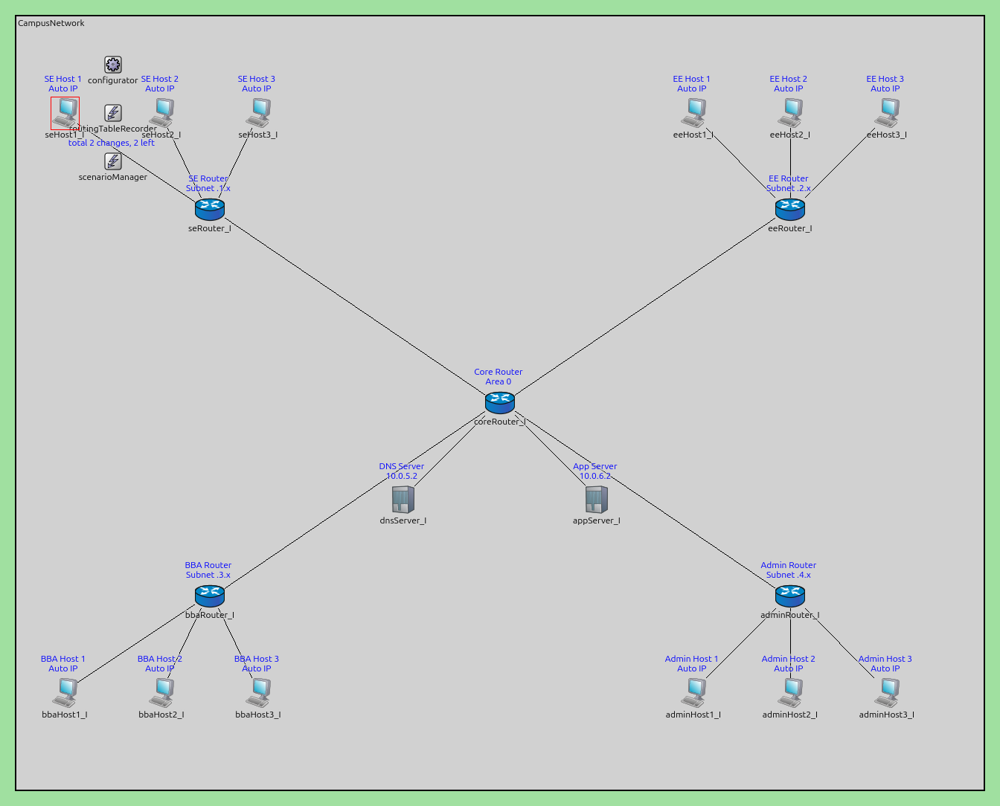

# NUCES Campus Network Simulation

A comprehensive network simulation project developed for the Computer Networks course at NUCES. This project simulates a large-scale campus network using **OMNeT++ 6.x** and the **INET Framework**, comparing three primary routing methodologies: **Custom Static Routing**, **RIP (Distance Vector)**, and **OSPF (Link State)**.

## Project Overview

The simulation models a campus environment with multiple departments (SE, EE, BBA, Admin), a central Core Router, and dedicated application/DNS servers. The network is tested under various traffic profiles (CBR and Bursty) and dynamic conditions, such as link failures and recoveries, to evaluate convergence time, throughput, and reliability.

## Network Topology

The campus network is designed as a **hierarchical star topology**, centered around a main Core Router that facilitates communication between four distinct departments and a centralized server farm.

### Topology Diagram

### Node Configuration
The simulation consists of **21 nodes**:
- **Routers (5)**: `coreRouter` (Central Hub), `seRouter`, `eeRouter`, `bbaRouter`, and `adminRouter`.
- **End Hosts (12)**: 3 dedicated hosts per department (e.g., `seHost1-3`).
- **Servers (2)**: `dnsServer` (10.0.5.2) and `appServer` (10.0.6.2).

### Link Characteristics
| Link Type | Connection | Data Rate | Delay | PER |
| :--- | :--- | :--- | :--- | :--- |
| **Backbone Link** | Core ↔ Dept Routers | 100 Mbps | 2 ms | 0.1% |
| **Access Link** | Dept Routers ↔ Hosts | 10 Mbps | 1 ms | — |
| **Server Link** | Core ↔ Servers | 100 Mbps | 1 ms | — |

### IP Addressing Scheme
#### Static Routing (Manual)
| Device Category | Node | IP Address |
| :--- | :--- | :--- |
| **Core & Servers** | `coreRouter` | 10.0.0.1 |
| | `dnsServer` | 10.0.5.2 |
| | `appServer` | 10.0.6.2 |
| **Dept Routers** | `seRouter` | 10.0.1.2 |
| | `eeRouter` | 10.0.2.2 |
| | `bbaRouter` | 10.0.3.2 |
| | `adminRouter` | 10.0.4.2 |
| **Hosts** | SE Hosts | 192.168.1.2 – 192.168.1.4 |
| | EE Hosts | 192.168.2.2 – 192.168.2.4 |
| | BBA Hosts | 192.168.3.2 – 192.168.3.4 |
| | Admin Hosts | 192.168.4.2 – 192.168.4.4 |

*Note: For RIP and OSPF, the INET configurator sequentially assigns /30 subnets from the 10.x.x.x space, while servers remain fixed.*

---

## Routing Methodologies

### 1. Custom Static Routing
Implemented using the `StaticRouter` C++ module.

#### Core Functionalities:
- **Table Loading**: Parses string-based `routeTable` from the `.ini` file using `std::stringstream` to populate a vector of `RouteEntry` objects.
- **Longest Prefix Match (LPM)**: Bitwise AND between the destination IP and stored subnetMask. The most specific (longest) match is selected.
- **Failure Simulation**: A self-message at t = 60s triggers the `isLinkBroken` flag, simulating a broken link on outPort 0 and dropping subsequent packets.
- **Buffering & Queuing**: Uses `portQueues` to store packets. `processQueues()` ensures packets are only transmitted when the link is idle (`getTransmissionFinishTime() <= simTime()`).
- **Utilities**:
    - `ipToInt()`: Converts dotted-decimal strings into 32-bit integers via bit-shifting.
    - `prefixToMask()`: Generates subnet masks using bitwise NOT and shift operators.

### 2. RIP (Routing Information Protocol)
- **Protocol**: RIPv2 (Distance-Vector).
- **Configuration**: 30s `updateInterval`, 90s `routeExpiryTime`, 30s `routePurgeTime`.
- **Loop Prevention**: Split Horizon with Poisoned Reverse (SPR).
- **Results**:
    - **Convergence Time**: Full reachability achieved in ~5 seconds.
    - **Failure Recovery**: 3–5 seconds due to `triggeredUpdate` mechanism.
    - **Overhead**: Consistent load of 4-8 Kbps per router.

### 3. OSPF (Open Shortest Path First)
- **Protocol**: OSPFv2 (Link-State).
- **Mechanism**: Dijkstra algorithm for shortest path calculation.
- **Configuration**: Area 0 (Backbone), tuned Hello/Dead intervals (2s/8s) for fast convergence.
- **Performance**: Provides faster convergence than RIP under high-load and bursty conditions, maintaining a higher Packet Delivery Ratio (PDR).

---

## Project Structure

### Important Files
| File | Description |
| :--- | :--- |
| **`omnetpp.ini`** | Central configuration file containing simulation parameters, IP assignments, and protocol settings. |
| **`topology.ned`** | Visual and structural definition of the campus network hierarchy and connections. |
| **`StaticRouter.cc / .h`** | C++ implementation of the custom static routing logic and LPM algorithm. |
| **`TrafficGenerator.cc / .h`** | C++ implementation of the application layer for generating synthetic network traffic. |
| **`TrafficGenerator.ned`** | Interface definition for the custom traffic generator application. |
| **`network.xml`** | IP address and default route configuration for the INET-based simulations (RIP/OSPF). |
| **`scenario_inet.xml`** | Scenario manager script for triggering link failures and recoveries in INET mode. |
| **`scenario.xml`** | Scenario script for triggering link events in custom Static mode. |

### Results Folder (`results/`)
The `results/` directory contains output data from simulation runs, including:
- **`.sca` / `.vec` Files**: Scalar and vector results for quantitative analysis (Delay, Throughput).
- **`.elog` Files**: Detailed event logs for visual debugging and convergence analysis.
- **Visualization Assets**: Includes `Barchart.png`, `link_utilization.png`, and `staticE2E.png` which represent analyzed performance metrics.
- **Analysis Files**: `Static.anf` and `ospf.anf` for OMNeT++ Analysis Tooling.

---

## Technical Contributions

This project was a collaborative effort, with each member focusing on a specific routing paradigm:

### 1. Uzair Majeed - Static Routing
- Developed the **Custom Static Routing** framework from scratch.
- Implemented the `StaticRouter` C++ class, including the **Longest Prefix Match (LPM)** algorithm.
- Designed the core `TrafficGenerator` application logic, including CBR/Bursty support and DNS mechanisms.

### 2. Muhammad Inam Ullah - RIP Protocol
- Configured and analyzed the **RIP** implementation using the INET Framework.
- Handled the IP Address Configurator settings for dynamic network numbering.
- Implemented the link failure scenario in `scenario_inet.xml` and measured RIP's convergence performance.

### 3. Abdul Basit - OSPF Protocol
- Led the implementation and tuning of **OSPF**.
- Configured OSPF Areas, interface costs, and timer parameters (Hello/Dead intervals).
- Analyzed OSPF's link-state database (LSDB) and compared its convergence speed against RIP.

---

## How to Run the Simulation

1. **Prerequisites**: Ensure **OMNeT++ 6.0+** and **INET Framework 4.4+** are installed and built in your workspace.
2. **Import Project**: Import the `CampusNetwork` folder into your OMNeT++ workspace.
3. **Select Configuration**: Open `omnetpp.ini` and select one of the following configurations:
   - `StaticRouting`: To test the custom C++ routing implementation.
   - `RIP`: To test the INET Distance-Vector protocol.
   - `OSPF`: To test the INET Link-State protocol.
4. **Run**: Right-click `omnetpp.ini` -> **Run As -> OMNeT++ Simulation**.
5. **View Results**: Use the OMNeT++ Analysis Tool to open files in the `results/` directory or view the generated `.png` graphs for performance insights.

---

## Analysis & Conclusion

The simulation results demonstrate that while **Static Routing** provides the lowest overhead and highest predictability for stable networks, **OSPF** significantly outperforms **RIP** in convergence time during link failures. The custom **Traffic Generator** allowed for precise stress-testing of these protocols, revealing that **OSPF** maintains a higher PDR (Packet Delivery Ratio) under bursty traffic conditions compared to the other methods.
